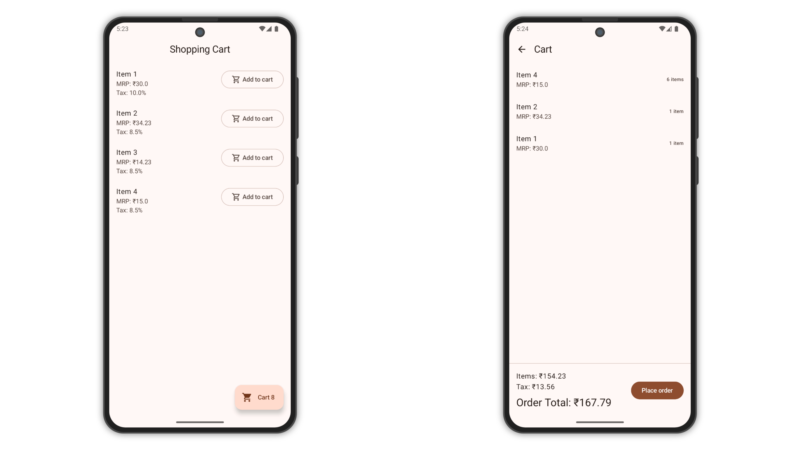

# Shopping Cart

Shopping Cart is a simple Android application built as part of a machine test. The app allows users
to browse a list of items fetched from a provided API, add items to a cart, and view the cart with
details such as subtotal, tax, and total. Cart items are persisted locally using a Room database,
ensuring they remain available even after the app is closed and reopened.

## Screenshots

<picture>
  <source media="(prefers-color-scheme: dark)" srcset="screenshots/screenshot-dark.png">
  <source media="(prefers-color-scheme: light)" srcset="screenshots/screenshot.png">
  
</picture>

## Features

- **Item List Screen**: Displays items fetched from the API with an option to add items to the cart.
  Adding the same item multiple times increments its quantity.
- **View Cart Screen**: Shows all items in the cart, including quantity, subtotal, tax, and total.
- **Local Storage**: Cart items are saved in a Room database for persistence.
- **Cart Summary**: Calculates and displays subtotal (sellingPrice * quantity), tax (based on
  taxPercentage), and total (subtotal + tax).
- **Error Handling**: Handles network errors, empty cart scenarios, and rapid user interactions.

## Tech Stack

- **Language**: Kotlin
- **Architecture**: Clean Architecture with MVVM (Model-View-ViewModel)
- **UI Framework**: Jetpack Compose
- **Networking**: Ktor Client
- **Local Storage**: Room Database
- **Asynchronous Programming**: Kotlin Coroutines
- **Dependency Injection**: Koin
- **Navigation**: Jetpack Navigation Component

## Setup Instructions

1. **Clone the Repository**:
   ```bash
   git clone https://github.com/mubashirpa/ShoppingCart.git
   ```
2. **Open in Android Studio**:
    - Open Android Studio and select `Open an existing project`.
    - Navigate to the cloned repository folder and select it.
3. **Sync Project**:
    - Click `Sync Project with Gradle Files` to download dependencies.
    - Ensure you have an active internet connection for the Gradle sync.
4. **Build the App**:
    - Select `Build > Make Project` to compile the app.
5. **Run the App**:
    - Connect an Android device or start an emulator with API 23 or higher.
    - Click `Run > Run 'app'` to install and launch the app.

## API Details

- **Endpoint**: `GET https://c01a428178544c239bb346a2e3a2293f.apl.mockbin.io/`
- **Response**: JSON array of items with `itemID`, `itemName`, `sellingPrice`, and `taxPercentage`.

## Contact

For any questions or issues, please contact `mubashirpa2002@gmail.com` or open an issue on the
repository.